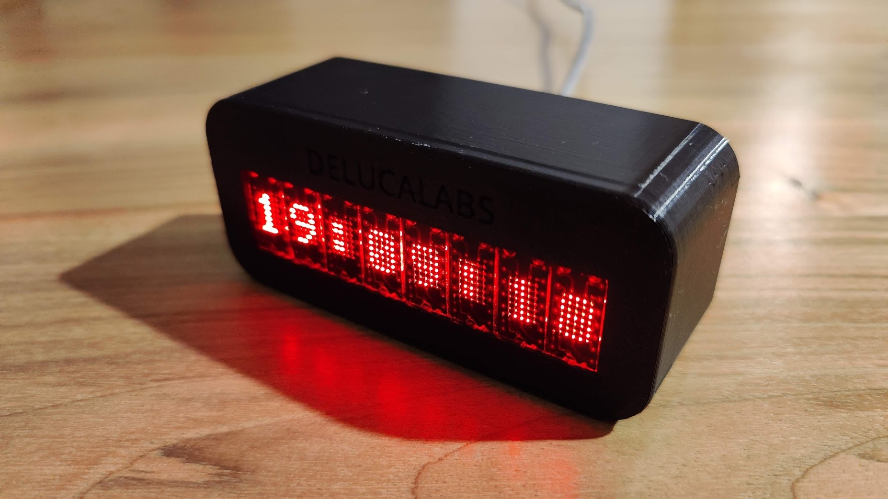
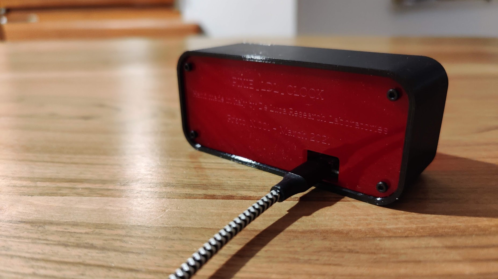
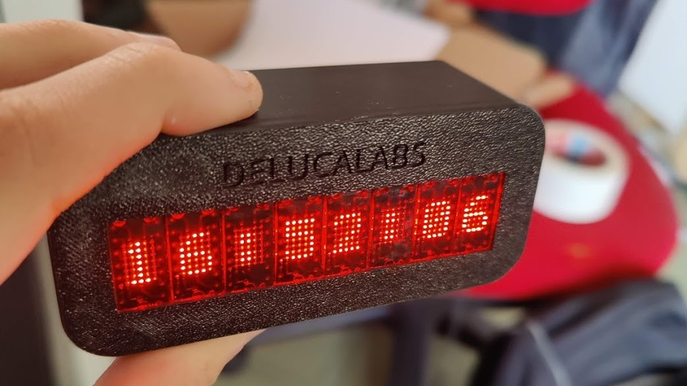

# Pixie_6digit_clock

This clock uses the beautiful Pixies display from Lixie Labs, that consists of a dot matrix led display module.

For this project I’ve used 4 of them and controlled them with a Wemos D1 Mini Esp8266.
You can buy the display at this link:
https://www.tindie.com/products/connornishijima/pixie-chainable-dual-57-micro-led-displays/

The Wemos (or simply an ESP8266) can be bought easily at Ebay on AliExpress.
https://it.aliexpress.com/item/32651747570.html

For mounting the back plate to the body I’ve used four M2x8mm screw and eight M2x6mm are needed to secure the display on the body
To connect the power, I’ve used a mini usb breakout board that I’ve found on AliExpress: 
https://it.aliexpress.com/item/4000550118202.html

The Arduino sketch that I’ve used is an example of the Pixie library and you can find it at this link:
https://github.com/connornishijima/Pixie/tree/master/examples/INTERNET_BASED/NTP_CLOCK

Follow the instruction at the pixie GitHub page to install the Arduino library.

| Front | Back |
|--------|--------|
| | |

Find additional info about each design in:
* <a href="https://github.com/lorenzo-dl/Pixie_6digit_clock/tree/main/3d">3D parts</a>
* <a href="https://github.com/lorenzo-dl/Pixie_6digit_clock/tree/main/laser">Laser cutted parts</a>
* <a href="https://github.com/lorenzo-dl/Pixie_6digit_clock/tree/main/images">Images</a>

# Print Settings

I’ve used Prusa Slicer and an original Prusa MK3S with the powder coated bed for the 3d printed parts.

All parts are printed from Prusament Petg Jet Black, with the “0.2mm SPEED” preset and no supports

All the stls are in the right orientation.

The back plate is intended to be laser cutted on 3mm acrylic (files included), but can be 3d printed as well, so I’ve included a stl file for it.

# Part List
- Printed parts
- Laser cutted parts (not necessary)
- 1x Wemos D1 mini
- 1x Micro USB board (not necessary but improves the look of the clock)
- 4x Pixie By Lixie Labs Display Module
- 4x M2x8 screw
- 8x M2x6 screw

# Assembly instruction 

Setup the dasy chain of the four Pixie modules as show in the pixie GitHub, connect them with the Wemos and upload the sketch. 

If You want connect the 5V and the ground terminal of the Wemos to the 5V and GND of the micro usb module than secure it to the main body part with glue.

Now get the back panel, insert in every 4 hole a screw and thread them on the plastic body.

Happy printing and enjoy your new clock.

### licensing and contacts
Thank you for reading and your interest, if you want more details feel free to visit the project <a href="https://github.com/lorenzo-dl/Pixie_6digit_clock">GitHub page</a> or contact me on Instagram <a href="https://www.instagram.com/delucalabs/">@delucalabs</a>.

This design is licensed under a :<a href="https://creativecommons.org/licenses/by-nc/4.0/">Creative Commons (4.0 International License) Attribution-NonCommercial</a>.

If you find this design useful, please consider a donation via <a href="https://paypal.me/LDL11">paypal.me/LDL11</a> for supporting new designs and further development. Thanks.

